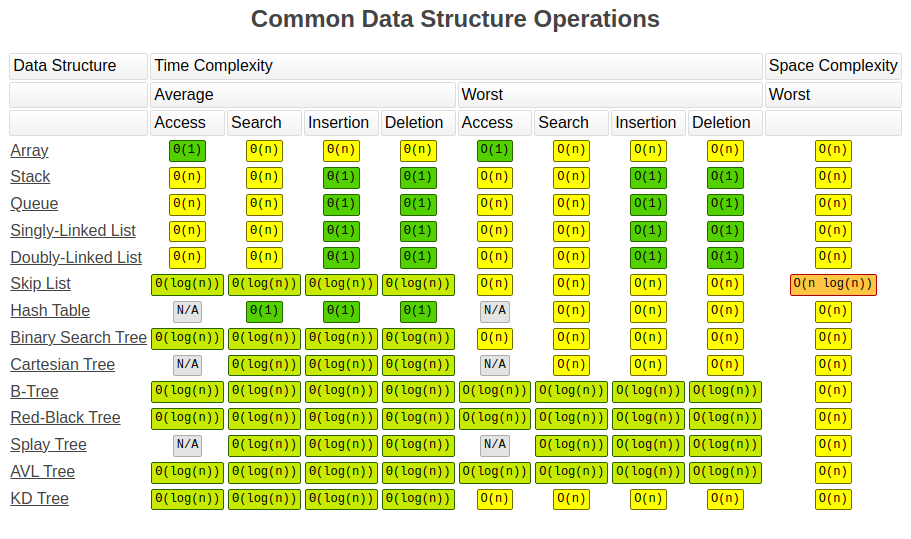

# Intro to Arrays


**Arrays** are an important data structure for any software developer. This way of organizing data allows us to store elements using indexes or keys.

Today, we will take a deep dive into arrays. By the end, you’ll know how to create and use arrays, also we will discuss several builtin JavaScript array methods.

## What are arrays?

A data structure is a way to organize data in a computer, so it can be effectively used in a program. An array is a type of data structure you can use to store some data you want to use in your program.

Arrays are a collection of individual values separated by a comma each with its own index/location. This collection could be anything: numbers, objects, more arrays, etc. In an array, the values, called elements, are stored in contiguous memory locations.

This means that all the elements are all in a sequence and they share a common border. The number of elements store in an array is referred to as the array’s **length**.

An array is one of the most efficient ways to store and access a sequence of values or store a collection of data with similar elements.

## Basic structure of arrays

The index of an element in an array is used to identify its location. For instance, if our array contains five numbers: 67, 12, 90, 76, 19, 38, 7. The index of 67 is 0, and that is its location in the array.

The index of 12 (the second element) is 1, and so on. Indexes always start from zero and increase by one. Let’s look at a visual example.


The image above shows an array of the elements A, B, C, and D, and their corresponding indexes. The array length would be four since there are four elements. The numbers beneath the elements refer to the places that the letters exist in the computer’s memory.

## Advantages and disadvantages of arrays

Every data structure has its advantages and disadvantages due to its basic organization.

some data structures are better for certain uses than others, so it's important to know what arrays do well and what they are not best suited to perform.

### Pros

- Store similar data of the same type.
- Store data when you already know the number of all the elements
- Implement other data structures like trees, graphs, stacks, etc.
- Store elements in different dimensions of arrays: two-dimensional or multidimensional.
- An array allocates memory in contiguous memory locations for every element. This avoids memory overflow.
- Iteration in arrays runs faster compared to other data structures.

### Cons

- If you want to use an array, you have to know the number of elements you want to store beforehand. It is impossible to add new/extra values once you declare it.
- The memory that is allocated to an array at declaration cannot be increased or decreased.
- Allocating more memory than you need can waste memory space.
- The cost of deleting and inserting elements is high because the elements of an array are stored in contiguous memory locations.
- Errors show up at runtime instead of compile-time because an array does not verify the indexes when compiling.

## Uses of arrays

Now we know what arrays look like and their advantages, but what can you actually do with an array? Let's take a look. An array can:

- Copy and clone elements
- Insert and delete elements
- Search and sort elements

Arrays allow you to maintain multiple variable names and large data with a single name. This removes the confusion of using multiple variables and improves code readability. You can also perform different matrix operations with the use of two-dimensional and multidimensional arrays.

Arrays can be used for sorting data elements. Different sorting techniques like bubble sort, insertion sort, and selection sort use arrays to store and sort elements easily.

## Using and modifying an array

Now that we know how to create an array, we need to learn how to apply operations and functions to make them useful for our program. We have the stored data, but what do we do next?

Well, let’s take a look at some of the common uses and modifications to arrays that are applied to most computer programs.

- ### Accessing a value in an array
  If you want to access an array, you first need to know the location of that array. This is why knowing how indexes work is important.

For instance, if we need to access Tonia’s score for Computer Science (93, the highest score) and store it in a variable highestScore, we first need to know its location. If we count from the left, starting at zero, the index of 93 will be 4. Our code for this would look like this:

```js
const testScores = [78, 90, 62, 88, 93, 50];
const highestScore = testScores[4];
console.log(highestScore);
```

- ### Modify an array
  So, what if we wanted to change the value of a score? Let’s assume that the last score was miscalculated, and Tonia actually got a score of 71.

To modify the last element, we find the index of the element we want to modify and set it equal to the new value we want to exchange it with.

In JavaScript, this would look like this:

```js
const testScores = [78, 90, 62, 88, 93, 50];
console.log(testScores[5]);
testScores[5] = 71;
console.log(testScores[5]);
```

- ### Inserting and deleting values
  Say Tonia took an extra Accounting class, and we wanted to add that score to the testScores array. To insert an element, there are a couple of methods you can use.

If you want to add a new element to the end of your array, you can use the **push()** method. Let’s add the score for her Accounting class at the end of the array.

You can do it in JavaScript like so:

```js
const testScores = [78, 90, 62, 88, 93, 50];
testScores.push(82);
console.log(testScores);
```

You can also add a new element to the beginning of an array using the **unshift()** method. Say Tonia has another two classes with scores of 74 and 58, and we want them at the front of our array. Let’s see how we’d do that below.

```js
const testScores = [78, 90, 62, 88, 93, 50];
testScores.unshift(74, 58);
console.log(testScores);
```

Deleting elements, on the other hand, has a number of methods you can use. The first one is the **pop()** method. This method lets you delete the last element in an array. If you wanted to remove the last test score, you can use it like so with JavaScript:

```js
const testScores = [78, 90, 62, 88, 93, 50];
testScores.pop();
console.log(testScores);
```

This method works by appending **pop()**; to the array variable. If you console.log this, you’ll notice that the last element is gone. In contrast to the **unshift()** method, you can use the **shift()** method to remove the first element of an array.

In our example below, we will remove the first element, 78, from the array of test scores and shift all the remaining elements to a lower index. Here’s how it’s done in JavaScript.

```js
const testScores = [78, 90, 62, 88, 93, 50];
testScores.shift();
console.log(testScores);
```


